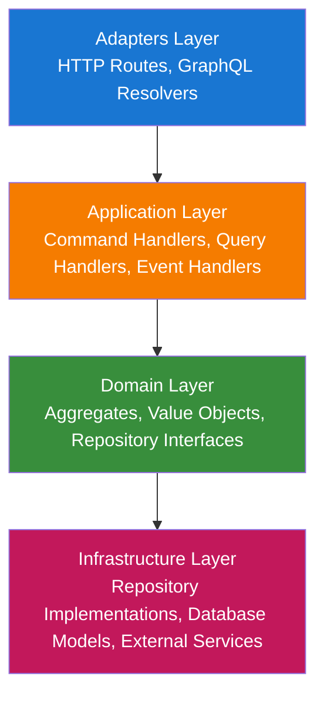
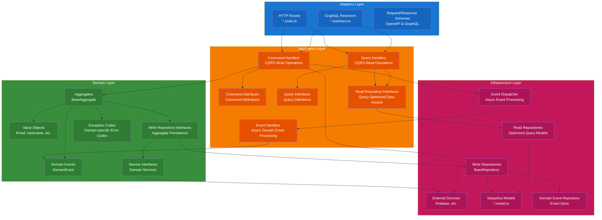
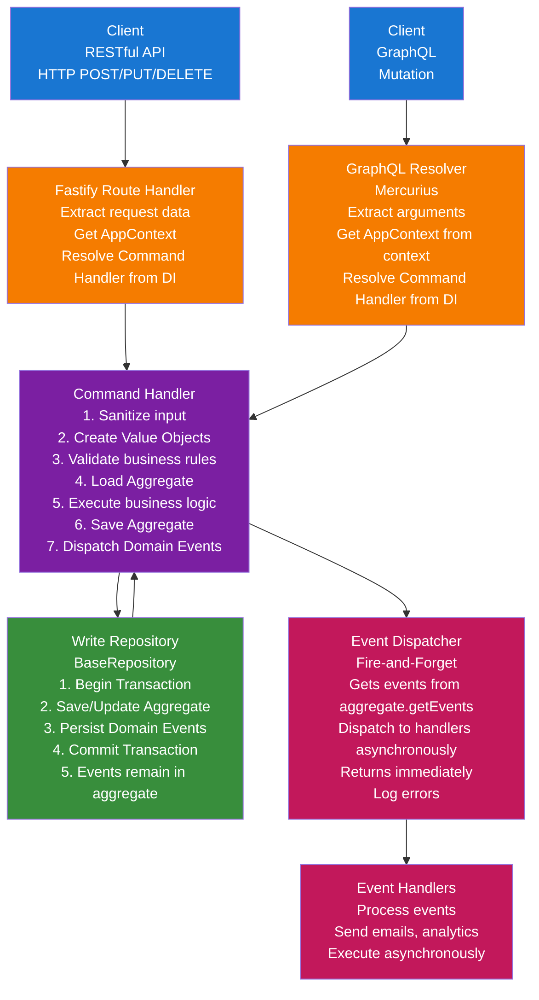
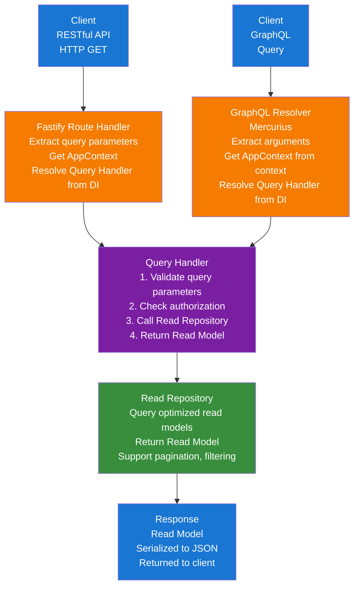
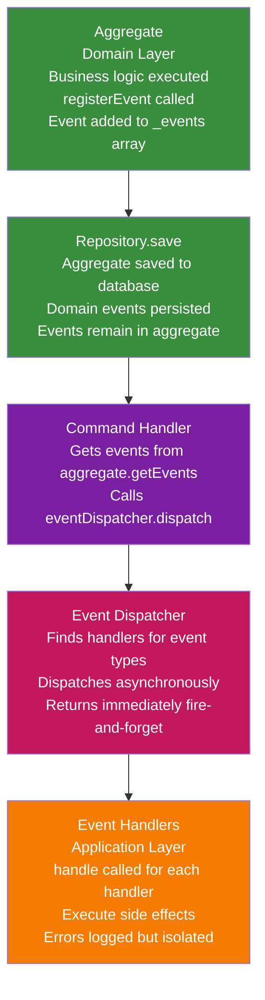

# Architecture

This API follows **Clean Architecture** and **Domain-Driven Design (DDD)** principles, implementing **CQRS (Command Query Responsibility Segregation)** with command and query handlers. The application is modular, maintainable, and testable.

## Table of Contents

1. [Architecture Overview](#architecture-overview)
2. [Layer Structure](#layer-structure)
3. [Data Flow](#data-flow)
4. [Layer Responsibilities](#layer-responsibilities)
   - [Domain Layer](#1-domain-layer-domain)
   - [Application Layer](#2-application-layer-application)
   - [Infrastructure Layer](#3-infrastructure-layer-infrastructure)
   - [Adapters Layer](#4-adapters-layer-adapters)
5. [Module Structure](#module-structure)
6. [Critical Design Patterns](#critical-design-patterns)
7. [Critical Features](#critical-features)
8. [Application Bootstrap](#application-bootstrap)
9. [Technology Stack](#technology-stack)

## Architecture Overview

The solution is organized into layers that enforce separation of concerns and dependency inversion:



**Layer Descriptions:**

- **Adapters Layer**: Handles external communication through HTTP routes and GraphQL resolvers. This layer adapts incoming requests and outgoing responses, using the service locator pattern to resolve command/query handlers directly from the dependency injection container.

- **Application Layer**: Orchestrates business operations using CQRS pattern with command handlers (writes), query handlers (reads), and event handlers (async processing). This layer coordinates domain objects and dispatches domain events.

- **Domain Layer**: Contains the core business logic with aggregates (root entities), value objects (immutable domain concepts), and repository interfaces. This layer has no external dependencies and represents the business domain.

- **Infrastructure Layer**: Implements technical concerns including repository implementations, database models (Sequelize models that map domain aggregates to PostgreSQL tables), and external service integrations (e.g., Firebase Authentication).

## Layer Structure

The complete layer structure with all components:



## Data Flow

### Command Flow (Write Operation)



### Query Flow (Read Operation)



### Domain Event Flow



## Layer Responsibilities

### 1. Domain Layer (`domain/`)

The core business logic layer with no external dependencies.

**Components:**

- **Aggregates**: Root entities that maintain consistency boundaries (e.g., `User`, `Role`, `UserGroup`)
  - Extend `BaseAggregate` for common functionality (version, events, audit fields)
  - Contain business logic and enforce invariants
  - Register domain events via `registerEvent()`
- **Value Objects**: Immutable objects representing domain concepts (e.g., `Email`, `Username`, `Password`)
  - Self-validating: `tryCreate()` returns validation result, `create()` throws if invalid
  - Type-safe: Strong typing prevents invalid values
- **Repository Interfaces**: Contracts for data access (e.g., `UserRepository`, `RoleRepository`)
  - Define write operations for aggregates
  - Located in `domain/interfaces/repositories/`
- **Service Interfaces**: Domain service contracts (e.g., `ExternalAuthenticationService`, `UserValidatorService`)
  - Located in `domain/interfaces/services/`
- **Exception Codes**: Business exception codes specific to the domain (e.g., `AuthExceptionCode`)
  - Located in `domain/enums/`
- **Domain Events**: Event types and event data structures
  - Located in `domain/enums/` (event types) and `common/domain/` (DomainEvent class)

**Key Principles:**

- No dependencies on other layers
- Pure business logic
- Entities are rich domain models with behavior
- Value objects enforce invariants through validation

### 2. Application Layer (`application/`)

Orchestrates domain objects to fulfill business operations using CQRS pattern.

**Components:**

- **Command Handlers**: Handle write operations (CQRS)
  - Implement `CommandHandler<TCommand, TResult>` interface
  - Located in `application/command-handlers/`
  - Execute business logic, coordinate domain objects, save aggregates
  - Explicitly dispatch domain events after saving aggregates using `eventDispatcher.dispatch(aggregate.getEvents())`
  - Create handlers return `CreateCommandResult` with `{ id: string }` instead of just the ID string
- **Query Handlers**: Handle read operations (CQRS)
  - Implement `QueryHandler<TQuery, TResult>` interface
  - Located in `application/query-handlers/`
  - Use read repositories for optimized queries
- **Event Handlers**: Process domain events asynchronously
  - Implement `EventHandler` interface
  - Located in `application/event-handlers/`
  - Subscribe to one or more event types using `eventTypes` array
  - Execute side effects (emails, analytics, etc.)
- **Command Interfaces**: Command definitions (input for command handlers)
  - Located in `application/interfaces/commands/`
  - Extend `Command` interface
- **Query Interfaces**: Query definitions (input for query handlers)
  - Located in `application/interfaces/queries/`
  - Extend `Query` interface
- **Read Repository Interfaces**: Contracts for optimized read operations
  - Located in `application/interfaces/repositories/`
  - Return read models, not domain aggregates
- **Read Models**: Query-optimized data structures for query results
  - Located in `application/interfaces/queries/` (e.g., `UserReadModel`)

**Key Principles:**

- Depends only on Domain layer
- Handlers coordinate domain objects
- Commands and queries are separate (CQRS)
- Stateless operations

### 3. Infrastructure Layer (`infrastructure/`)

Implements technical concerns and external integrations.

**Components:**

- **Write Repositories**: Implement domain repository interfaces
  - Extend `BaseRepository<TAggregate>` for common functionality
  - Located in `infrastructure/repositories/`
  - Work with domain aggregates, handle optimistic locking, persist events
- **Read Repositories**: Optimized read models for queries
  - Implement read repository interfaces from application layer
  - Located in `infrastructure/repositories/` (e.g., `*.read-repository-impl.ts`)
  - Return read models, support pagination, filtering, sorting
- **Database Models**: Sequelize models for PostgreSQL
  - Located in `infrastructure/models/`
  - Export `modelConfiguration` for automatic discovery
- **Model Associations**: Sequelize model relationships
  - Located in `infrastructure/models/associations.ts`
  - Export `associationConfiguration` for automatic discovery
- **External Services**: Third-party integrations
  - Located in `infrastructure/services/`
  - Implement domain service interfaces (e.g., `FirebaseAuthenticationService`)
- **Domain Event Repository**: Persists domain events to database
  - Located in `common/infrastructure/repositories/`
- **Event Dispatcher**: Asynchronously dispatches events to handlers
  - Located in `common/infrastructure/event-dispatcher.ts`
  - Called from Application layer (command handlers), not from Infrastructure layer
  - Returns immediately (fire-and-forget pattern), doesn't wait for handlers to complete

**Key Principles:**

- Implements interfaces defined in Domain layer
- Handles technical details (database, external APIs)
- Isolated from business logic

### 4. Adapters Layer (`adapters/`)

Handles external communication and adapts requests/responses.

**Components:**

- **Routes**: HTTP route definitions with OpenAPI schemas
  - Located in `adapters/routes/`
  - Export `routeConfiguration` for automatic discovery
  - Resolve command/query handlers directly from DI container using service locator pattern
  - Use command/query interfaces directly (no DTOs)
- **GraphQL Resolvers**: GraphQL API endpoints
  - Located in `adapters/graphql/`
  - Export resolvers object (e.g., `authResolvers`) for automatic discovery
  - Resolve command/query handlers directly from DI container using service locator pattern
  - Use command/query interfaces directly (no DTOs)
- **GraphQL Schemas**: GraphQL type definitions
  - Located in `adapters/graphql/`
  - Export schema strings (e.g., `authSchema`) for automatic discovery
- **Schemas**: Request/response validation schemas
  - Defined inline in route files (e.g., `adapters/routes/*.route.ts`)

**Key Principles:**

- Depends on Application layer
- Framework-specific (Fastify)
- Routes and resolvers resolve handlers directly from DI container
- Use command/query interfaces directly (no DTOs)
- Read models returned directly from query handlers

## Module Structure

The application is organized into **modules**, each representing a bounded context. Modules follow a consistent structure that enables automatic discovery:

```text
modules/
└── {module-name}/
    ├── domain/                      # Domain layer
    │   ├── aggregates/              # Aggregate roots (e.g., User, Role)
    │   ├── value-objects/           # Value objects (e.g., Email, Username)
    │   ├── interfaces/              # Domain interfaces
    │   │   ├── repositories/        # Write repository interfaces
    │   │   └── services/            # Domain service interfaces
    │   ├── enums/                   # Exception codes, event types, domain enums
    │   └── types/                   # Domain types (if needed)
    ├── application/                 # Application layer
    │   ├── command-handlers/        # Command handlers (CQRS write)
    │   ├── query-handlers/          # Query handlers (CQRS read)
    │   ├── event-handlers/          # Event handlers (async processing)
    │   ├── interfaces/              # Application interfaces
    │   │   ├── commands/            # Command interfaces
    │   │   ├── queries/             # Query interfaces
    │   │   └── repositories/        # Read repository interfaces
    ├── infrastructure/              # Infrastructure layer
    │   ├── models/                  # Sequelize models (auto-discovered)
    │   │   ├── *.model.ts           # Model files with modelConfiguration
    │   │   └── associations.ts # Model associations (auto-discovered)
    │   ├── repositories/            # Repository implementations
    │   │   ├── *.repository-impl.ts # Write repositories
    │   │   └── *.read-repository-impl.ts # Read repositories
    │   └── services/                # Service implementations
    ├── adapters/                    # Adapters layer
    │   ├── routes/                  # HTTP routes (auto-discovered)
    │   │   └── *.route.ts           # Route files with routeConfiguration
    │   ├── graphql/                 # GraphQL (auto-discovered)
    │   │   ├── *.schema.ts          # GraphQL schemas
    │   │   └── *.resolvers.ts       # GraphQL resolvers
    └── module-configuration.ts      # Module registration (auto-discovered)
```

**Application-Level Routes:**

Application-level routes (shared across modules) are located in:

```text
application/
└── adapters/
    └── routes/                      # Application-level routes (auto-discovered)
        └── *.route.ts               # Route files with routeConfiguration
```

## Critical Design Patterns

### 1. Clean Architecture / Layered Architecture

**Purpose**: Enforce separation of concerns and dependency inversion.

**Implementation:**

- **Domain Layer**: Pure business logic, no external dependencies
- **Application Layer**: Orchestrates domain objects, depends only on Domain
- **Infrastructure Layer**: Implements technical concerns, implements Domain interfaces
- **Adapters Layer**: Handles external communication, depends on Application

**Benefits:**

- Testability: Domain logic can be tested without infrastructure
- Maintainability: Changes in one layer don't affect others
- Flexibility: Easy to swap implementations (e.g., different databases)

### 2. Domain-Driven Design (DDD)

**Purpose**: Model complex business domains with rich domain models.

**Key Components:**

- **Aggregates**: Root entities that maintain consistency boundaries (`BaseAggregate`)
- **Value Objects**: Immutable objects representing domain concepts (`Email`, `Username`)
- **Repository Pattern**: Abstracts data access behind domain interfaces
- **Domain Events**: Capture business events for side effects
- **Bounded Contexts**: Modules represent distinct business capabilities

**Benefits:**

- Business logic is explicit and testable
- Domain model reflects business reality
- Clear boundaries between contexts

### 3. CQRS (Command Query Responsibility Segregation)

**Purpose**: Separate read and write operations for better scalability and optimization.

**Implementation:**

- **Commands**: Write operations handled by `CommandHandler` implementations
- **Queries**: Read operations handled by `QueryHandler` implementations
- **Write Repositories**: Work with domain aggregates, handle business logic
- **Read Repositories**: Optimized for queries, return read models

**Benefits:**

- Optimized read models (no need to load full aggregates)
- Clear separation between reads and writes
- Can scale reads and writes independently

### 4. Repository Pattern

**Purpose**: Abstract data access behind domain interfaces.

**Implementation:**

- **Domain Interfaces**: Define contracts in `domain/interfaces/repositories/`
- **Infrastructure Implementations**: Implement using Sequelize in `infrastructure/repositories/`
- **BaseRepository**: Provides common aggregate persistence with event support
- **Read Repositories**: Separate interfaces for optimized read operations

**Benefits:**

- Domain layer doesn't depend on infrastructure
- Easy to swap data access implementations
- Testable domain logic without database

### 5. Dependency Injection (DI)

**Purpose**: Achieve loose coupling through constructor injection.

**Implementation:**

- **Awilix Container**: DI container with constructor injection
- **Module Configuration**: Each module registers dependencies in `module-configuration.ts`
- **Singleton Pattern**: Services, repositories, handlers registered as singletons
- **Container Access**: Available on Fastify instance via `app.diContainer`

**Benefits:**

- Loose coupling between components
- Easy to test (can inject mocks)
- Centralized dependency management

### 6. Service Locator Pattern

**Purpose**: Resolve dependencies at runtime from DI container.

**Implementation:**

- Routes and resolvers receive DI container via Fastify instance
- Routes and resolvers resolve handlers directly from container: `container.resolve('handlerName')`
- Handlers are resolved directly in route handlers and GraphQL resolvers

**Benefits:**

- Flexible dependency resolution
- Supports lazy loading
- Works well with automatic discovery

### 7. Aggregate Pattern

**Purpose**: Maintain consistency boundaries and encapsulate business logic.

**Implementation:**

- **BaseAggregate**: Base class providing common aggregate functionality
- **Optimistic Locking**: Version field prevents concurrent modification conflicts
- **Domain Events**: Aggregates register events via `registerEvent()`
- **Rich Domain Models**: Aggregates contain business logic, not just data

**Benefits:**

- Consistency boundaries are clear
- Prevents data corruption through optimistic locking
- Business logic encapsulated in aggregates

### 8. Value Object Pattern

**Purpose**: Represent domain concepts with validation and immutability.

**Implementation:**

- Immutable objects (no setters)
- Self-validating: `tryCreate()` returns validation result
- Type-safe: Strong typing prevents invalid values
- Examples: `Email`, `Username`, `Password`, `Uuid`

**Benefits:**

- Invalid values cannot exist
- Type safety at compile time
- Validation logic encapsulated

### 9. Domain Events Pattern

**Purpose**: Capture business events for side effects and eventual consistency.

**Implementation:**

- **DomainEvent**: Immutable event object with aggregate context
- **Event Registration**: Aggregates register events via `registerEvent()`
- **Event Persistence**: Events saved to database in same transaction as aggregate (in repository)
- **Event Dispatching**: Command handlers receive events from repository and dispatch them via EventDispatcher
- **Event Dispatcher**: Asynchronously dispatches events to handlers (called from Application layer)
  - Handlers subscribe to one or more event types using `eventTypes` array
  - Each handler is registered for all event types in its `eventTypes` array
- **Event Handlers**: Process events for side effects (emails, analytics, etc.)
  - Handlers implement `EventHandler` interface with `eventTypes: string[]` property
  - A handler can subscribe to multiple event types by including them in the `eventTypes` array

**Benefits:**

- Decoupled side effects from main business logic
- Eventual consistency across bounded contexts
- Audit trail of business events

### 10. Command/Query Handler Pattern (CQRS)

**Purpose**: Encapsulate business operations in dedicated handler classes.

**Implementation:**

- **CommandHandler Interface**: `execute(command, context): Promise<Result>`
- **QueryHandler Interface**: `execute(query, context): Promise<Result>`
- **Handler Registration**: Handlers registered in module configuration
- **Direct Handler Resolution**: Routes and resolvers resolve handlers directly from DI container

**Benefits:**

- Single Responsibility: Each handler does one thing
- Testability: Handlers can be tested in isolation
- Clear separation: Commands vs Queries

### 11. Automatic Discovery Pattern (Convention over Configuration)

**Purpose**: Eliminate manual registration through file system conventions.

**Implementation:**

- **Module Discovery**: Scans for `module-configuration.ts` files
- **Model Discovery**: Scans for `*.model.ts` files with `modelConfiguration` export
- **Route Discovery**: Scans for `*.route.ts` files with `routeConfiguration` export
- **Association Discovery**: Scans for `associations.ts`
- **GraphQL Discovery**: Scans for `*.schema.ts` and `*.resolvers.ts` files

**Benefits:**

- No manual registration needed
- Follow conventions and it "just works"
- Easy to add new modules/features

### 12. Configuration Pattern

**Purpose**: Export configuration objects for automatic discovery.

**Implementation:**

- **ModuleConfiguration**: `{ registerDependencies, registerErrorCodes }`
- **ModelConfiguration**: `{ register: (sequelize) => void }`
- **RouteConfiguration**: `{ tags, register: (app) => void }`
- **AssociationConfiguration**: `{ register: () => void }`

**Benefits:**

- Consistent configuration structure
- Enables automatic discovery
- Clear module boundaries

### 13. Optimistic Locking Pattern

**Purpose**: Prevent concurrent modification conflicts without database locks.

**Implementation:**

- **Version Field**: Each aggregate has a `version` number
- **prepareUpdate()**: Validates version and increments it
- **Save Validation**: Repository checks version matches before update
- **Conflict Detection**: Throws `OUTDATED_VERSION` exception on mismatch

**Benefits:**

- Prevents lost updates
- No database-level locking needed
- Better performance than pessimistic locking

### 14. Factory Pattern (Value Objects)

**Purpose**: Create validated value objects through factory methods.

**Implementation:**

- **tryCreate()**: Returns `{ valueObject?, validationResult? }`
- **create()**: Throws exception if invalid (for known-valid inputs)
- **Validation**: Encapsulated in factory method

**Benefits:**

- Invalid values cannot be created
- Validation logic in one place
- Type-safe creation

### 15. Template Method Pattern (BaseRepository)

**Purpose**: Define skeleton of algorithm in base class, let subclasses implement specifics.

**Implementation:**

- **BaseRepository**: Provides `save()` template method
- **Abstract Methods**: `getAggregateName()`, `getModel()`, `toDomain()`
- **Subclasses**: Implement abstract methods, inherit save logic

**Benefits:**

- Code reuse: Common persistence logic in base class
- Consistency: All repositories follow same pattern
- Event support: Built into base class

## Critical Features

### 1. Automatic Module Discovery

**What**: The application automatically discovers and registers modules, models, routes, GraphQL schemas/resolvers, and associations without manual configuration.

**How It Works:**

1. `module-discovery.ts` scans `modules/*/` directories
2. Finds `module-configuration.ts` files (module registration)
3. Finds `*.model.ts` files (database models)
4. Finds `*.route.ts` files (HTTP routes)
5. Finds `associations.ts` files (model associations)
6. Finds `*.schema.ts` and `*.resolvers.ts` files (GraphQL)

**Benefits:**

- Zero configuration: Just create files following conventions
- Easy to add new modules: No central registry to update
- Convention over configuration: Follow patterns, it works

### 2. CQRS with Read/Write Separation

**What**: Commands (writes) and Queries (reads) are handled separately with optimized repositories.

**How It Works:**

- **Write Side**: Command handlers use write repositories that work with domain aggregates
- **Read Side**: Query handlers use read repositories that return optimized read models
- **Separation**: Write repositories handle business logic, read repositories are optimized for queries

**Benefits:**

- Performance: Read models optimized for queries (no need to load full aggregates)
- Scalability: Can scale reads and writes independently
- Clarity: Clear separation between read and write operations

### 3. Domain Events with Event Sourcing

**What**: Business events are captured and persisted, then dispatched asynchronously to handlers.

**How It Works:**

1. Aggregates register events via `registerEvent()`
2. Events are persisted to `domain_events` table in same transaction as aggregate (in repository `save()` method)
3. Events remain in the aggregate after save (not cleared automatically)
4. Command handler gets events from aggregate via `aggregate.getEvents()` and dispatches them explicitly via `EventDispatcher` (Application layer)
5. Event dispatcher returns immediately (fire-and-forget), doesn't wait for handlers
6. Event handlers process events asynchronously for side effects

**Benefits:**

- Decoupled side effects: Main logic doesn't wait for side effects
- Audit trail: All business events are recorded
- Eventual consistency: Handlers can update other systems asynchronously

### 4. Optimistic Locking

**What**: Prevents concurrent modification conflicts using version numbers.

**How It Works:**

1. Each aggregate has a `version` field (starts at 0)
2. Before update, `prepareUpdate(operatorId)` is called (no version parameter needed - version is managed internally)
3. `prepareUpdate()` validates the current version and increments it automatically
4. Repository checks version matches before saving
5. If version mismatch, throws `OUTDATED_VERSION` exception
6. Update commands no longer require a `version` field - version is managed internally by the aggregate

**Benefits:**

- Prevents lost updates
- No database-level locking (better performance)
- Clear error when conflicts occur

### 5. Dependency Injection with Service Locator

**What**: Dependencies are injected via constructor, resolved from DI container.

**How It Works:**

1. Awilix container manages all dependencies
2. Modules register dependencies in `module-configuration.ts`
3. Routes and resolvers resolve handlers directly from container: `container.resolve('handlerName')`
4. All dependencies registered as singletons

**Benefits:**

- Loose coupling: Components don't know about concrete implementations
- Testability: Easy to inject mocks
- Centralized management: All dependencies in one place

### 6. Value Objects with Self-Validation

**What**: Domain concepts are represented as immutable, self-validating value objects.

**How It Works:**

- Value objects are immutable (no setters)
- `tryCreate()` returns validation result (doesn't throw)
- `create()` throws exception if invalid (for known-valid inputs)
- Validation logic encapsulated in value object

**Benefits:**

- Invalid values cannot exist
- Type safety at compile time
- Validation logic in one place

### 7. Error Code Registry

**What**: Centralized mapping of domain exception codes to HTTP status codes.

**How It Works:**

1. Each module registers error codes in `module-configuration.ts`
2. Error handler middleware catches exceptions
3. Maps exception code to HTTP status using registry
4. Returns consistent error response format

**Benefits:**

- Consistent error responses across all modules
- Centralized error handling
- Easy to add new error codes

### 8. Application Context (AppContext)

**What**: User context and permissions attached to every request.

**How It Works:**

1. `onRequest` hook extracts Firebase token from `Authorization` header
2. Token is verified and user context extracted
3. User context (userId, roles, permissions) attached to `request.appContext`
4. Available in all route handlers and handlers

**Benefits:**

- Consistent access to user context
- Authorization checks in handlers
- No need to extract token in every handler

## Application Bootstrap

The application follows this initialization sequence:

1. **Environment Loading**: Load environment variables
2. **Fastify Instance**: Create Fastify app with logger and AJV configuration
3. **Error Code Registry**: Create and register application-level error codes
4. **Module Discovery**: Automatically discover modules, models, associations, routes, and GraphQL
5. **Database Initialization**: Initialize Sequelize connection
6. **Dependency Injection**: Create DI container and register application-level services
7. **Model Registration**: Register all discovered models with Sequelize
8. **Association Registration**: Register all discovered model associations
9. **Middleware Registration**: CORS, rate limiting, Swagger, GraphQL, error handling
10. **Module Registration**: Register module dependencies and error codes
11. **Route Registration**: Register all discovered routes with Fastify
12. **External Services Initialization**: Initialize Firebase, JWT service
13. **Authentication Hook**: Register global hook to extract user context
14. **Server Start**: Listen on configured port

## Technology Stack

- **Runtime**: Node.js with ES Modules
- **Framework**: Fastify (high-performance HTTP server)
- **Language**: TypeScript (strict mode)
- **Database**: PostgreSQL with Sequelize ORM
- **Authentication**: Firebase Authentication (ID tokens)
- **Dependency Injection**: Awilix
- **API Documentation**: OpenAPI/Swagger
- **GraphQL**: Mercurius (Fastify plugin)
- **Testing**: Vitest (100% coverage requirement)
- **Validation**: AJV (Fastify built-in) + custom domain validation
