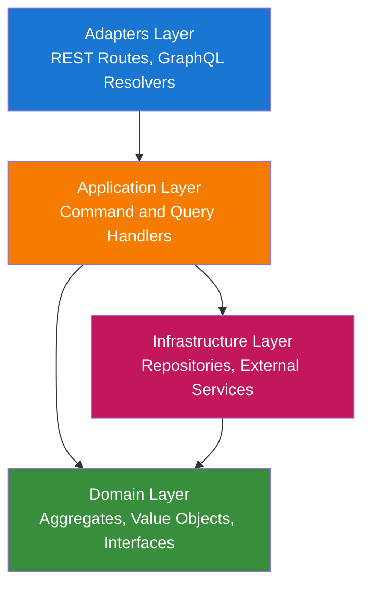
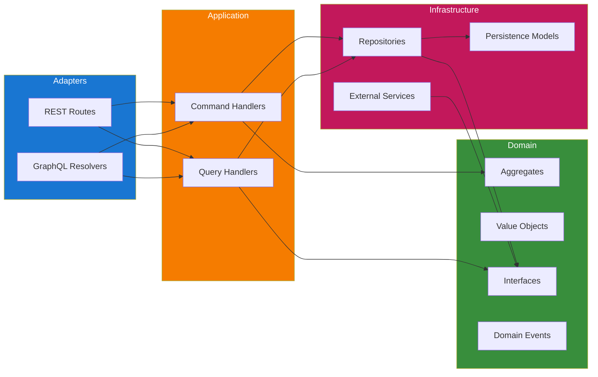
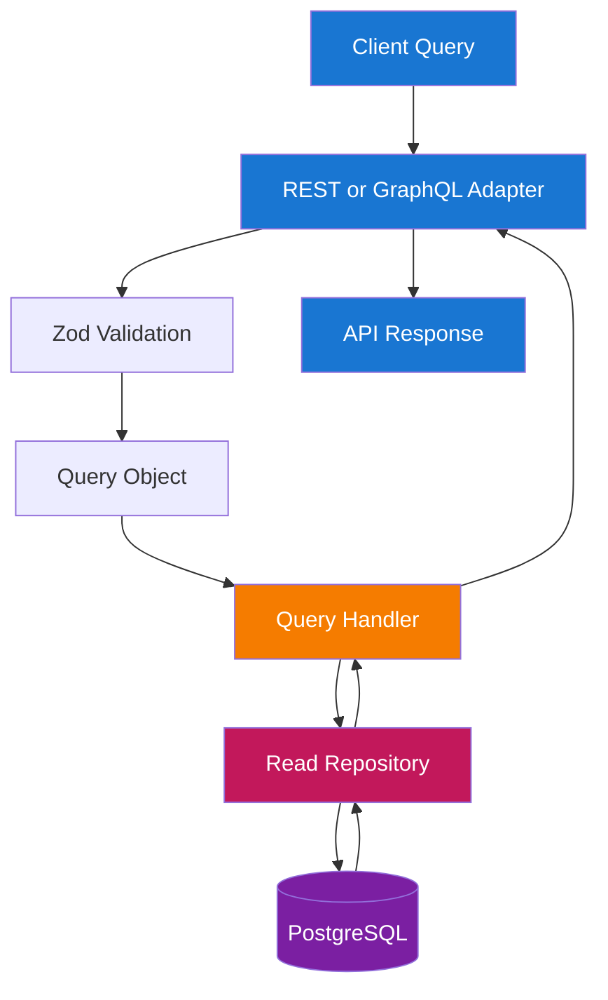
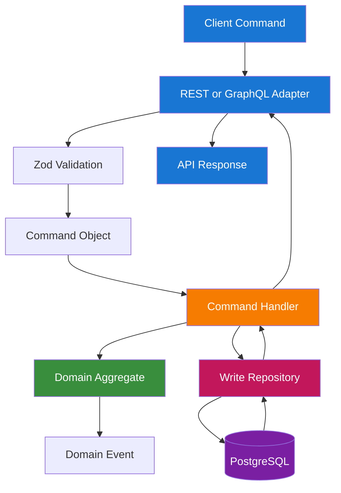

# Architecture

## Table of Contents

1. [Architecture Overview](#architecture-overview)
2. [Layer Structure](#layer-structure)
3. [Data Flow](#data-flow)
4. [Layer Responsibilities](#layer-responsibilities)
5. [Module Structure](#module-structure)
6. [Critical Design Patterns](#critical-design-patterns)
7. [Technology Stack](#technology-stack)

## Architecture Overview

This API follows Clean Architecture with DDD and CQRS. Code is organized by feature module, and each module is split into layers with strict dependency direction.


```mermaid
graph TD
    A[Adapters Layer<br/>REST Routes, GraphQL Resolvers] --> B[Application Layer<br/>Command and Query Handlers]
    B --> C[Domain Layer<br/>Aggregates, Value Objects, Interfaces]
    D[Infrastructure Layer<br/>Repositories, External Services] --> C
    B --> D

    style A fill:#1976d2,color:#fff
    style B fill:#f57c00,color:#fff
    style C fill:#388e3c,color:#fff
    style D fill:#c2185b,color:#fff
```

High-level goals:

- Keep business rules independent from frameworks and transport details.
- Keep read and write concerns explicit with query and command handlers.
- Keep external systems replaceable behind interfaces.
- Keep modules isolated so teams can ship features safely.

## Layer Structure

The API uses four layers inside each feature module:

- `domain`: business rules, aggregates, value objects, domain services, domain events
- `application`: use cases, command/query handlers, orchestration logic
- `infrastructure`: repositories, persistence mapping, external service implementations
- `adapters`: HTTP routes, GraphQL resolvers, DTO mapping, transport-specific contracts

Cross-cutting composition lives in `src/application` and `src/common`.


```mermaid
graph LR
    subgraph Adapters["Adapters"]
        direction TB
        Rest[REST Routes]
        Gql[GraphQL Resolvers]
    end

    subgraph Application["Application"]
        direction TB
        Cmd[Command Handlers]
        Qry[Query Handlers]
    end

    subgraph Domain["Domain"]
        direction TB
        Agg[Aggregates]
        Vo[Value Objects]
        Iface[Interfaces]
        Events[Domain Events]
    end

    subgraph Infrastructure["Infrastructure"]
        direction TB
        Repos[Repositories]
        Svc[External Services]
        Db[Persistence Models]
    end

    Rest --> Cmd
    Rest --> Qry
    Gql --> Cmd
    Gql --> Qry
    Cmd --> Agg
    Qry --> Iface
    Cmd --> Repos
    Qry --> Repos
    Repos --> Iface
    Svc --> Iface
    Repos --> Db

    style Adapters fill:#1976d2,color:#fff
    style Application fill:#f57c00,color:#fff
    style Domain fill:#388e3c,color:#fff
    style Infrastructure fill:#c2185b,color:#fff
```

## Data Flow

### Read Flow (Query Request)


```mermaid
flowchart TD
    Client[Client Query] --> Adapter[REST or GraphQL Adapter]
    Adapter --> Validator[Zod Validation]
    Validator --> Query[Query Object]
    Query --> Handler[Query Handler]
    Handler --> ReadRepo[Read Repository]
    ReadRepo --> Db[(PostgreSQL)]
    Db --> ReadRepo
    ReadRepo --> Handler
    Handler --> Adapter
    Adapter --> Response[API Response]

    style Client fill:#1976d2,color:#fff
    style Adapter fill:#1976d2,color:#fff
    style Handler fill:#f57c00,color:#fff
    style ReadRepo fill:#c2185b,color:#fff
    style Db fill:#7b1fa2,color:#fff
    style Response fill:#1976d2,color:#fff
```

1. Client sends HTTP or GraphQL query.
2. Adapter validates input and builds a query object.
3. Query handler calls read repositories.
4. Infrastructure returns read models.
5. Adapter maps read models to API response schema.

### Write Flow (Command Request)


```mermaid
flowchart TD
    Client[Client Command] --> Adapter[REST or GraphQL Adapter]
    Adapter --> Validator[Zod Validation]
    Validator --> Command[Command Object]
    Command --> Handler[Command Handler]
    Handler --> Aggregate[Domain Aggregate]
    Aggregate --> Event[Domain Event]
    Handler --> Repo[Write Repository]
    Repo --> Db[(PostgreSQL)]
    Db --> Repo
    Repo --> Handler
    Handler --> Adapter
    Adapter --> Response[API Response]

    style Client fill:#1976d2,color:#fff
    style Adapter fill:#1976d2,color:#fff
    style Handler fill:#f57c00,color:#fff
    style Aggregate fill:#388e3c,color:#fff
    style Repo fill:#c2185b,color:#fff
    style Db fill:#7b1fa2,color:#fff
    style Response fill:#1976d2,color:#fff
```

1. Client sends command payload.
2. Adapter validates payload and builds command object.
3. Command handler loads aggregate(s) and executes domain behavior.
4. Infrastructure persists aggregate state and domain events.
5. Adapter returns success or error response.

## Layer Responsibilities

### 1. Domain Layer (`src/modules/{module}/domain/`)

- Encapsulates business invariants.
- Owns aggregate behavior and lifecycle rules.
- Defines repository/service interfaces consumed by application.
- Emits domain events when meaningful state changes occur.

### 2. Application Layer (`src/modules/{module}/application/`)

- Implements command and query handlers.
- Coordinates repositories and domain services.
- Enforces use-case-level authorization and validation order.
- Does not depend on HTTP, GraphQL, or database details.

### 3. Infrastructure Layer (`src/modules/{module}/infrastructure/`)

- Implements domain and application interfaces.
- Contains database models, repository implementations, and mappers.
- Integrates external providers (Firebase Admin SDK, JWT, etc.).
- Handles persistence and provider-specific concerns.

### 4. Adapters Layer (`src/modules/{module}/adapters/`)

- Exposes module capabilities via REST and GraphQL.
- Declares request/response schemas.
- Maps transport payloads to commands/queries.
- Maps domain/application errors to API-safe responses.

## Module Structure

### Project Structure Overview

```text
src/
  application/
    container.ts
    middleware/
  common/
    infrastructure/
    interfaces/
    utils/
  modules/
    auth/
      adapters/
      application/
      domain/
      infrastructure/
      interfaces/
      module-configuration.ts
```

## Critical Design Patterns

### 1. Clean Architecture / Layered Architecture

Dependencies point inward: adapters -> application -> domain. Infrastructure implements interfaces owned by domain/application.

### 2. Modular Feature Structure

Each feature module owns its domain, use cases, adapters, and infrastructure. This minimizes cross-module coupling.

### 3. Dependency Injection (Awilix)

Services, repositories, and handlers are wired through a container for explicit composition and easy test substitution.

### 4. Persistence and External Services (Infrastructure)

Database repositories and external integrations are implementation details in infrastructure. Application logic stays provider-agnostic.

### 5. Zod for Validation and Types

Zod schemas are used for request validation and OpenAPI/GraphQL contracts, keeping runtime validation aligned with TypeScript types.

### 6. Interfaces for Infrastructure

Domain and application layers depend on contracts, not concrete classes. This keeps provider swaps and testing straightforward.

## Technology Stack

- Runtime: Bun + TypeScript (strict)
- API: Hono, GraphQL
- Validation and contracts: Zod, OpenAPI helpers
- Data: PostgreSQL
- Auth: Firebase Admin SDK + JWT
- Quality: ESLint, Prettier, Vitest
