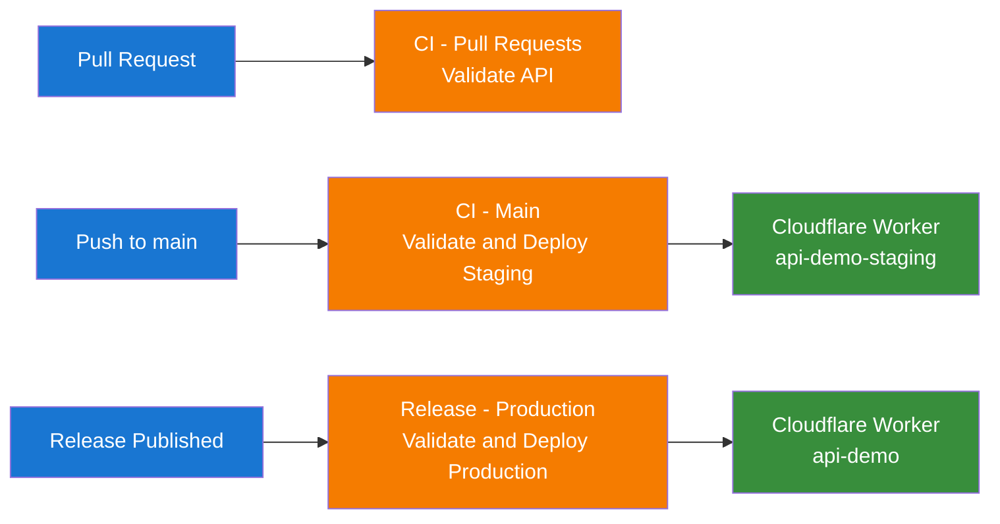

# Deployment

## Table of Contents

1. [Overview](#overview)
2. [Database and Firebase Setup](#database-and-firebase-setup)
3. [Cloudflare Workers Setup](#cloudflare-workers-setup)
4. [GitHub Actions CI/CD](#github-actions-cicd)
5. [Environment Variables](#environment-variables)

## Overview

The API is deployed to Cloudflare Workers using Wrangler. CI workflows run validation first, then deploy to staging on `main` and to production on release.



Deployment targets:

- Staging: `api-demo-staging`
- Production: `api-demo`

## Database and Firebase Setup

### 1. Provision PostgreSQL

Create read/write database endpoints and ensure they are reachable from Cloudflare runtime.

### 2. Configure Firebase

Create a Firebase service account with required permissions and configure authentication providers.

## Cloudflare Workers Setup

### 1. Create a Cloudflare Account

Create a Cloudflare account and a Workers project if you do not already have one.

### 2. Configure Wrangler

`api/wrangler.toml` defines defaults for staging. CI overrides worker name during deploy.

### 3. Custom Domains (Optional)

Map staging and production domains to each worker name as needed.

## GitHub Actions CI/CD

### Workflow Overview

- `ci-pull-requests.yml`: validate changed projects
- `ci-main.yml`: validate + deploy staging for changed projects
- `ci-release.yml`: validate + deploy production for changed projects

### Required GitHub Secrets

- `CLOUDFLARE_API_TOKEN`
- `CLOUDFLARE_ACCOUNT_ID`
- `CODECOV_TOKEN`
- project runtime secrets (for example Firebase and database credentials)

### Deploy Step Example

```yaml
- name: Deploy to Cloudflare Workers (Staging)
  uses: cloudflare/wrangler-action@v3
  with:
    apiToken: ${{ secrets.CLOUDFLARE_API_TOKEN }}
    accountId: ${{ secrets.CLOUDFLARE_ACCOUNT_ID }}
    command: deploy --name api-demo-staging
    workingDirectory: api
```

## Environment Variables

Core runtime variables:

- `WRITE_DATABASE_URI`
- `READ_DATABASE_URI`
- `FIREBASE_SERVICE_ACCOUNT_JSON`
- `FIREBASE_API_KEY`
- `JWT_PRIVATE_KEY`
- `JWT_PUBLIC_KEY`

### Local Development

```bash
cp .env.example .env
bun run migrate
bun run dev
```

### Production

- Store sensitive variables as Cloudflare secrets.
- Keep non-sensitive defaults in `wrangler.toml` or environment-specific config.
- Run migrations before promoting a release.
