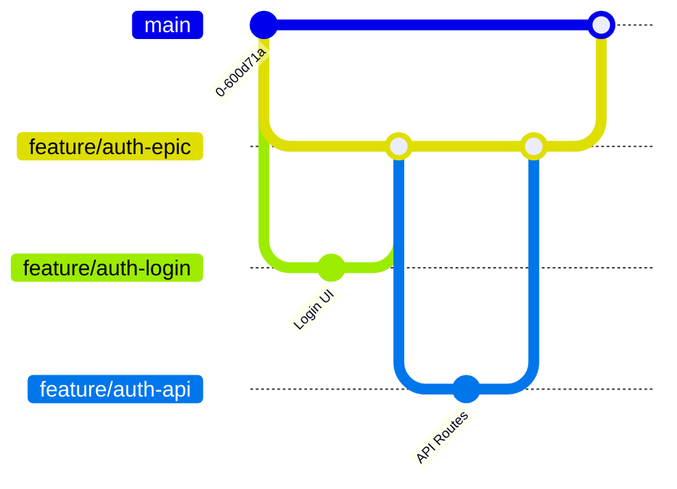

# Phase 2: Development Template

This document outlines the standard process for **implementation** in the development lifecycle, focusing on workflows, code standards, and collaboration.

## Table of Contents

- [Overview](#overview)
- [Process Checklist](#process-checklist)
- [Feature Flags Strategy](#feature-flags-strategy)
- [Artifacts Required](#artifacts-required)
- [Handling Large Features & Parallel Development](#handling-large-features--parallel-development)
- [Simulation](#-simulation-building-auth-backend--frontend)
- [Template: Git Commit Workflow](#template-git-commit-workflow)

## Overview

**Goal:** Write clean, modular code to implement the approved feature.
**Input:** A GitHub Issue in **Ready** column with specs.
**Output:** A coded feature branch ready for Pull Request (PR).
**Key Tools:** VS Code, Git, Feature Flags.

## Process Checklist

- [ ] **Status:** Move Issue to **In progress**.
- [ ] **Branch:** Create a new branch from `main` (e.g., `feature/auth-login`).
- [ ] **Feature Flag:** Wrap new UI or logic in a flag if it's not ready for release.
- [ ] **Atomic Commits:** Commit often with descriptive messages.
- [ ] **Tests:** Write unit tests for business logic.
- [ ] **Rebase:** Keep up to date with `main` daily.
- [ ] **Coordination:** Pull from shared parent branch if applicable.

## Feature Flags Strategy

Feature flags (or feature toggles) are critical for our "Merge Early, Deploy Often" philosophy. They allow us to ship incomplete or risky code to Production without breaking the user experience.

### Why we use them

- **De-risk Deployments:** If a feature breaks Production, we disable the flag instantly. No reverts required.
- **Enable Atomic PRs:** You can merge a half-finished backend endpoint if it's hidden behind a flag.
- **Beta Testing:** Enable features only for specific users (e.g., `@company.com` emails) before global launch.

### Implementation Pattern

1. **Define the Flag:** Add it to your config (e.g., `isAuthEnabled`). Default to `false`.
2. **Wrap the UI/Logic:**

   **Mobile (Flutter):**

   ```dart
   if (FeatureFlags.isAuthEnabled) {
     return NewLoginScreen();
   } else {
     return SizedBox.shrink(); // Hide completely
   }
   ```

   **Web (React/Next.js):**

   ```tsx
   if (!FeatureFlags.showLoginButton) return null;
   return <LoginButton />;
   ```

3. **Cleanup (Crucial):**
   - Once a feature is 100% rolled out and stable (e.g., after 2 weeks), **remove the flag**.
   - **Do not** keep old flags forever. They create technical debt and complex testing paths.
   - Create a P3/P2 task in the backlog: `chore: remove [feature] flag/dead code`.

## Artifacts Required

1. **Code Changes:** Modular, documented, and following style guides.
2. **Unit Tests:** Passing tests covering critical paths.
3. **Local Build:** Verify it runs locally without errors.

---

## Handling Large Features & Parallel Development

When a feature is too large for a single PR (e.g., **"Authentication"** includes Sign In, Sign Up, Forgot Password, and Profile), multiple developers may work on it simultaneously.

### Strategy: The "Epic Branch" Pattern

1. **Create a Shared Parent Branch:**
   - Create a long-lived branch from `main` called `feature/auth-epic`.
   - **Do not** merge this into `main` until the entire feature is ready.

2. **Create Sub-Branches:**
   - Developers create branches _from_ `feature/auth-epic` (not `main`).
   - Examples: `feature/auth-login-ui`, `feature/auth-api-endpoints`, `feature/auth-forgot-password`.

3. **Merge Flow:**
   - `feature/auth-login-ui` -> PR -> `feature/auth-epic`.
   - `feature/auth-api-endpoints` -> PR -> `feature/auth-epic`.
   - Once `feature/auth-epic` is complete and tested -> PR -> `main`.

4. **Coordination Daily:**
   - Developers must `git pull origin feature/auth-epic` into their sub-branches daily to get updates from teammates.

### Diagram



---

## 🎭 Simulation: "Building Auth (Backend & Frontend)"

**Scenario:** The Engineering team starts building the Authentication feature planned in Phase 1.

### The Conversation

**Role Players:**

- **Ben (Backend Engineer)**
- **Max (App Engineer - Flutter)**
- **Zoe (Web Engineer - Next.js)**

#### 1. Kickoff (Slack #dev-channel)

##### Ben (Backend)

> Picking up the Auth API task. I'll scaffold the Firebase integration.

##### Max (App)

> Cool. I'll start on the Login UI in Flutter. I'll mock the API calls for now.

##### Zoe (Web)

> Wait, are we using the same Auth provider for web? I need the redirect URLs for OAuth.

#### 2. Coordination (GitHub Comments)

##### Ben

> Yes, same provider. I've updated the `FirebaseConfig` in the repo. Check the new env vars in `.env.example`.

##### Zoe

> Got it. I'll update the `LoginButton` component on the landing page to use those.

#### 3. Implementation Details (Code)

##### A. Backend (Ben's Branch: `feature/auth-api`)

```typescript
// backend/features/auth/service.ts
import { auth } from "./firebase-admin";

export const verifyToken = async (token: string) => {
  try {
    const decodedToken = await auth.verifyIdToken(token);
    return decodedToken;
  } catch (error) {
    throw new AuthError("Invalid token");
  }
};
```

##### Ben (Backend Logic)

> Just pushed the initial service logic. Added unit tests for token validation.

##### B. Mobile App (Max's Branch: `feature/app-login-ui`)

```dart
// lib/features/auth/login_screen.dart
class LoginScreen extends StatelessWidget {
  final AuthService authService;

  // Use a Feature Flag to safely merge half-done work
  if (!FeatureFlags.isAuthEnabled) return Container();

  return Scaffold(
    body: Column(
      children: [
        TextField(controller: _emailController),
        ElevatedButton(onPressed: _login, child: Text("Sign In")),
      ],
    ),
  );
}
```

##### Max (Mobile UI)

> UI is done. Waiting on the real API endpoint, but it works with mocks.

#### 4. The 'Blocker' (Slack)

##### Max (Blocker Report)

> @Ben, the login API returns a 400 when the password is weak. Can we standardize the error message format?

##### Ben (Response)

> Good catch. I'll update the error response schema to include a user-friendly `message` field. Give me 30 mins.

#### 5. Ready for Review

##### Zoe (PR Ready)

> Web implementation is solid. All tests pass locally. Opening my PR now.

##### Max (PR Ready)

> Same here for mobile. It's behind a feature flag so it won't break production.

---

## Template: Git Commit Workflow

```bash
# 1. Start fresh
git checkout main
git pull
git checkout -b feature/auth-login

# 2. Daily Work (Atomic Commits)
git add .
git commit -m "feat(auth): scaffold login screen UI"
git commit -m "style(auth): match Figma spacing"
git commit -m "test(auth): add unit test for email validation"

# 3. Rebase (Avoid Merge Conflicts)
git fetch origin main
git rebase origin/main

# 4. Push
git push -u origin feature/auth-login
```
