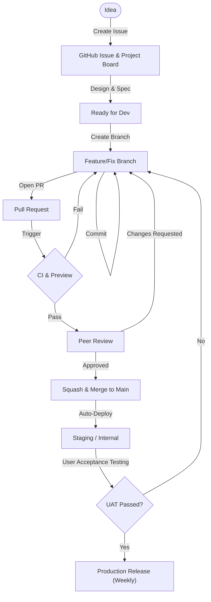
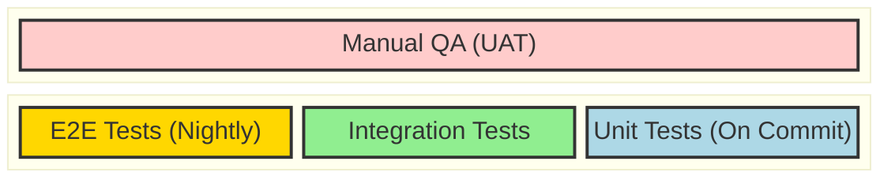
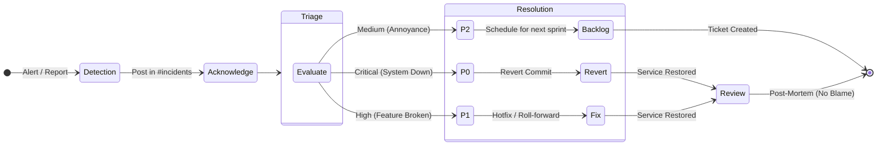
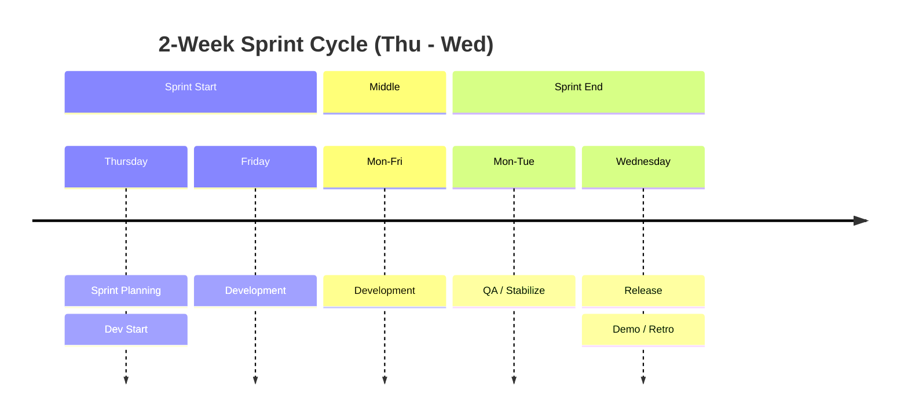

# Engineering Handbook (Lean & Quality-First)

## Table of Contents

- [1. Core Philosophy](#1-core-philosophy-move-fast-break-things-in-dev-fix-before-merge)
- [2. Team Structure & Roles](#2-team-structure--roles)
- [3. The Development Workflow (Lifecycle)](#3-the-development-workflow-lifecycle)
- [4. Technology Standards](#4-technology-standards)
- [5. Quality Assurance (QA) Strategy](#5-quality-assurance-qa-strategy)
- [6. Incident Management](#6-incident-management)
- [7. Meeting Schedule (Minimalist)](#7-meeting-schedule-minimalist)

---

## 1. Core Philosophy: "Move Fast, Break Things (in Dev), Fix Before Merge"

For a small, high-velocity team (5-20 members), strict corporate bureaucracy kills momentum. However, chaos kills quality. Our framework balances speed and stability through automation and clear ownership.

### Key Principles

1. **Ship Often:** Deployment should be routine, not an event. Target daily releases for Web/API, weekly for App Stores.
2. **Quality shift-left:** Bugs are cheapest to fix during development. CI/CD catches regressions, not humans.
3. **One Source of Truth:** GitHub is the center of our universe (Code, Tasks, Discussions, CI/CD).
4. **Everything as Code:** Infrastructure, pipelines, and documentation are versioned in git.

---

## 2. Team Structure & Roles

We operate as **cross-functional squads** rather than siloed departments.

| **Role**                               | **Responsibilities**                                                                                                |
| :------------------------------------- | :------------------------------------------------------------------------------------------------------------------ |
| **CTO / Solutions Architect (Alex)**   | Sets technical strategy, architectural standards, and data models. Final decision maker on tech stack and security. |
| **App Engineer - Flutter (Max)**       | Owners of the core cross-platform product. Responsible for unit tests, UI tests, and app store release quality.     |
| **Web Engineer - Next.js (Zoe)**       | Owners of landing pages and web modules. Responsible for responsive design tests and SEO checks.                    |
| **Backend Engineer (Ben)**             | Core API architecture and database. Responsible for API integration tests, security, and data integrity.            |
| **Product Owner - PM/Founder (Sarah)** | Defines the _What_ and _Why_. Performs User Acceptance Testing (UAT) on Staging before release.                     |
| **Designer - UI/UX (Mia)**             | Delivers high-fidelity prototypes. Works closely with engineers during implementation.                              |
| **Marketing Lead / Growth (Leo)**      | Owns go-to-market strategy, content, and SEO. Drives user acquisition and works with Web Engineer on landing pages. |

---

## 3. The Development Workflow (Lifecycle)

We use a lightweight **Kanban** approach with specific milestones.

### Phase 1: Planning & Design (The "What")

> **[📖 Detailed Guide: Planning & Design](./development-workflow/01-planning-and-design.md)**

- **Tool:** GitHub Projects (Board View).
- **Process:**
  1. **Idea -> Issue**: Every feature/bug starts as a GitHub Issue.
  2. **Spec/Design**: Link Figma designs and write a brief technical approach in the Issue description.
  3. **Triage**: Issues are prioritized and prioritized into the `Backlog`.

#### Priority Levels (Triage Matrix)

| Priority          | Description                                                   | Example                        | Target                       |
| :---------------- | :------------------------------------------------------------ | :----------------------------- | :--------------------------- |
| **P0 (Critical)** | **Blocker.** System is unusable or core value prop is broken. | Login fails, Data loss.        | **Fix Immediately (Hotfix)** |
| **P1 (High)**     | **Required.** Must be in the upcoming release.                | New Auth flow, Payment bug.    | **Current Sprint**           |
| **P2 (Medium)**   | **Standard.** Important but can wait one cycle.               | Profile edit, minor UI glitch. | **Next Sprint**              |
| **P3 (Low)**      | **Nice-to-have.** Cosmetic or non-critical improvement.       | Dark mode polish, typography.  | **Backlog**                  |

### Project Board Structure (Kanban)

We use a standard 5-column GitHub Project board to track status:

1.  **🔴 Backlog:** New ideas, bugs, and lower priority items. Not yet committed.
2.  **🔵 Ready:** Spec'd, prioritized, and "Ready for Dev". Developers pick from here.
3.  **🟡 In progress:** Actively being worked on. Branch created.
4.  **🟣 In review:** PR is open. Waiting for review or CI checks.
5.  **🟠 Done:** Merged to `main` and verified.

### Phase 2: Development (The "How")

> **[📖 Detailed Guide: Development](./development-workflow/02-development.md)**

#### Strategy: Modified GitHub Flow (Trunk-Based Development)

1. **The Golden Rule:** `main` is Production. It is always stable and deployable.
2. **The Cycle:**
   - **Branch:** Create short-lived branches from `main` (e.g., `feature/new-login`, `fix/crash`).
   - **Work:** Commit changes. Branches normally last **1-2 days max**.
   - **PR:** Open a Pull Request to merge back into `main`.
   - **Merge:** Squash and merge after checking green lights (CI/Review).

#### Platform Specifics

- **Landing Pages (Next.js):** **Continuous Delivery**. Merges to `main` deploy immediately to Production.
- **Main App / Backend:** **Weekly Release Cycle**.
  - Merge to `main` = Deploys to **Staging/Internal** (TestFlight).
  - Wednesday Release = Promotes Staging build to Production/App Stores.

#### Core Rules

- **Never** push directly to `main`.
- **Feature Flags:** All incomplete or risky features MUST be wrapped in Feature Flags. This allows us to merge code safely without releasing the feature to users.
- **Rebase/Sync** often: Pull `main` into your branch daily to avoid "merge hell".
- **Atomic PRs:** If a feature takes 2 weeks, break it into 10 smaller PRs (hidden behind flags).

### Phase 3: Code Review & Quality (The "Gate")

> **[📖 Detailed Guide: Review & Quality](./development-workflow/03-review-quality.md)**

- **The Pull Request (PR):**
  - **Title:** Conventional Commits format (e.g., `feat: add user login`, `fix: crash on launch`).
  - **CI Checks (Automated):**
    - **Linting:** `eslint`, `flutter analyze` (Zero tolerance for warnings).
    - **Tests:** Unit tests must pass.
    - **Build:** The app must compile.
    - **Preview Environments:** Automatically deployed for every PR (Web).
    - **Human Review:**
      - At least **1 approval** required from a peer.
      - Focus on logic, security, and readability, not style (linters handle that).

### Phase 4: Release & Environment Strategy (The "Ship")

> **[📖 Detailed Guide: Release](./development-workflow/04-release.md)**

We use **Environments** to separate testing from production.

#### 1. Preview Environment (Ephemeral)

- **Trigger:** Every Open Pull Request.
- **Audience:** Developer, Designer, Peer Reviewer.
- **Purpose:** "Does this specific feature work as designed?"
- **Action:** Verify UI/UX and logic _before_ merging.

#### 2. Staging / Internal Environment (Branch: `main`)

- **Trigger:** Every merge to `main`.
- **Audience:** Internal Team, QA, Beta Testers, "Dogfooding".
- **Web:** Deploys to `staging.example.com`.
- **Mobile:** Uploads to TestFlight (Internal Group) / Google Play (Internal Track).
- **Purpose:** "Does the app work as a whole?" (Integration Testing).

#### 3. Production Environment (Tags: `v*`)

- **Trigger:** Manual GitHub Release (e.g., `v1.2.0`) created from `main`.
- **Frequency:** Weekly (e.g., "Release Wednesdays").
- **Audience:** Real Users.
- **Action:** Promotes the **exact same build** from Staging to Production (for Web) or submits to App Store Review (for Mobile).

---

## 4. Technology Standards

### Frontend (Marketing Sites)

- **Framework:** Next.js (TypeScript)
- **Scope:** Landing pages, blogs, and marketing funnels.
- **Styling:** Tailwind CSS + ShadCN

### Main App (Web / Mobile / Desktop)

- **Framework:** Flutter (Dart)
- **Scope:** The core product application (Login required).

### Backend

- **Runtime:** Node.js
- **Framework:** Hono / Internal Framework
- **Database:** PostgreSQL (with Drizzle ORM)

### Infrastructure

- **Cloud:** Cloudflare (Pages for Web, Workers for API) + AWS (Database & Services)
- **IaC:** Pulumi
- **Containerization:** Docker

### Repository Strategy

- **Structure:** Monorepo (Single Repository) with strictly separated applications.
  - `landing-pages`: Next.js (Marketing Sites).
  - `app`: Flutter (Core Product).
  - `api`: Hono (Backend).
- **Dependency Management:** Each app manages its own dependencies. No shared internal packages to avoid coupling.
- **GitHub Project Management:**
  - **Single Board:** All tasks live in one project.
  - **Labels:** Use `area:frontend`, `area:mobile`, `area:backend` to filter views.
  - **Views:** Create specific views for each team (e.g., "Mobile Sprint") based on these labels.
- **CI/CD Strategy:** Use GitHub Actions `paths` filters to only run workflows for changed apps.
  - Changes in `landing-pages/**` -> Deploy Landing Page only.
  - Changes in `app/**` -> Run Flutter CI only.

---

## 5. Quality Assurance (QA) Strategy

We do not have a dedicated "QA Department." **Quality is a shared responsibility, primarily owned by Engineers and the Product Owner.**

- **Engineers** are responsible for automated tests (Unit/Integration) and ensuring their code works before opening a PR.
- **The Product Owner** is responsible for User Acceptance Testing (UAT) and UI review on Staging/Preview environments, often with the Designer.

1. **Unit Tests:**
   - Backend business logic.
   - Utility functions.
   - Critical complex UI state.
2. **Integration Tests:**
   - API endpoints (happy paths + error handling).
   - Database transactions.
3. **E2E Tests:**
   - Critical User Journeys (Login, Checkout, Core Feature) using **Cypress/Playwright** (Web) or **Patrol/Maestro** (Mobile).
   - Run on `main` nightly or before release, not on every PR (too slow).
4. **Manual QA (User Acceptance Testing):**
   - **Who:** Product Owner & Designer.
   - **When:** On Staging environment (every Wednesday before the release train departs).
   - **What:** Verify the "Happy Path" for new features and check for regressions in core flows.

---

## 6. Incident Management

When things break (and they will):

1. **Acknowledge:** Post in `#incidents` Slack/Discord channel.
2. **Triaging:** Determine severity.
   - _P0 (Critical)_: System down, data loss. Drop everything.
   - _P1 (High)_: Core feature broken. Fix today.
   - _P2 (Medium)_: Annoyance. Next sprint.
3. **Fix:** Revert commit (fastest) or Roll-forward (fix commit).
4. **Incident Review (Post-Mortem):** Write a doc. **No blame.** Focus on process/system improvement (e.g., "Add a test case for scenario X").

---

## 7. Meeting Schedule (Minimalist)

- **Daily Standup (Async):** Slack/Discord update. "Yesterday / Today / Blockers".
- **Sprint Planning (Every 2 weeks, Thursday):** 1 hour max. Pick top items from backlog.
- **Demo/Retro (Every 2 weeks, Wednesday):** 1 hour. Show off work, discuss process improvements.
- **Ad-hoc:** "Pair Programming" sessions to unblock or design complex features.

---

_This document is a living framework. Challenge it, improve it, and update it via Pull Request._
