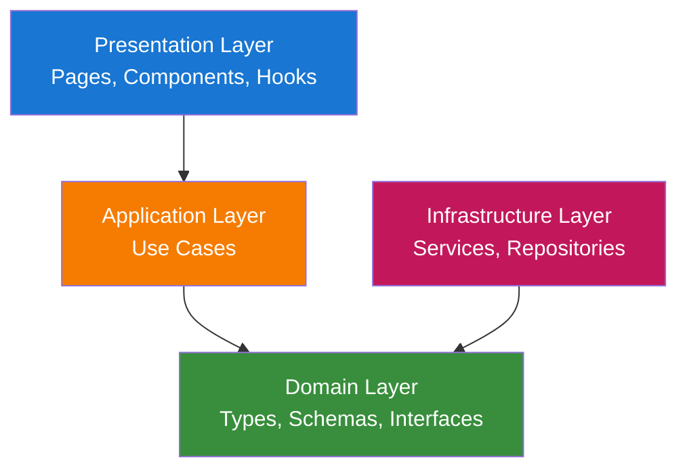
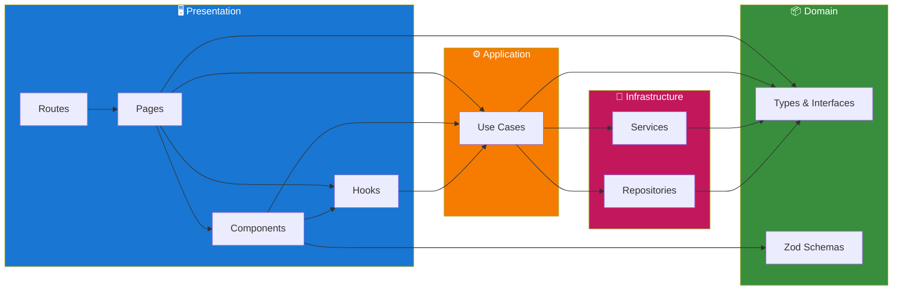
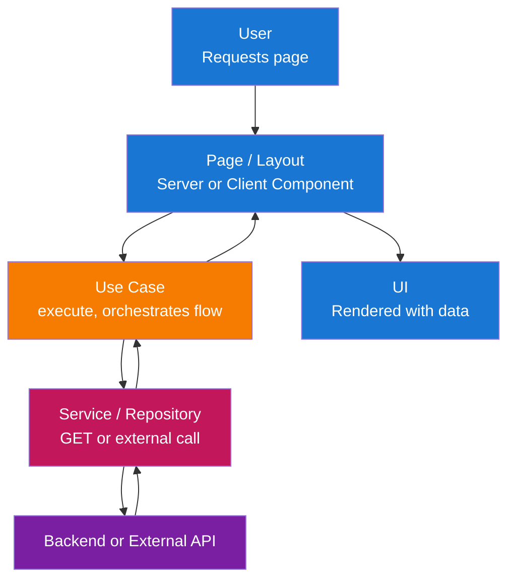
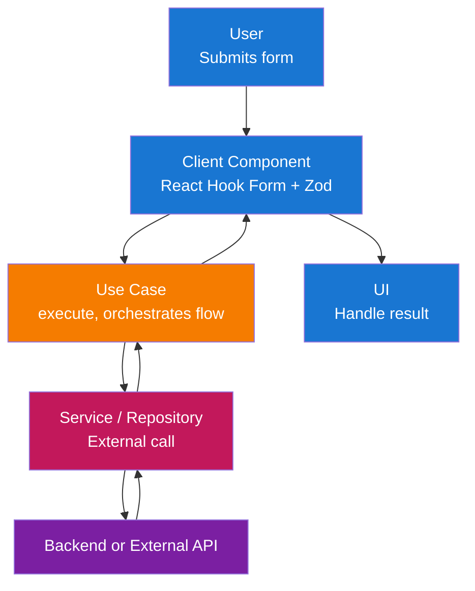

# Architecture

This frontend follows **Clean Architecture** with a **modular** structure. The application is maintainable, testable, and aligned with Next.js and the chosen UI stack.

## Table of Contents

1. [Architecture Overview](#architecture-overview)
2. [Layer Structure](#layer-structure)
3. [Data Flow](#data-flow)
4. [Layer Responsibilities](#layer-responsibilities)
   - [Domain Layer](#1-domain-layer-srcmodulesmoduledomain)
   - [Application Layer](#2-application-layer-srcmodulesmoduleapplication)
   - [Infrastructure Layer](#3-infrastructure-layer-srcmodulesmoduleinfrastructure)
   - [Presentation Layer](#4-presentation-layer-srcmodulesmodulepresentation)
5. [Module Structure](#module-structure)
6. [Critical Design Patterns](#critical-design-patterns)
7. [Technology Stack](#technology-stack)

## Architecture Overview

The solution is organized into layers that enforce separation of concerns and dependency inversion:



**Layer Descriptions:**

- **Presentation Layer**: Entry points for user interaction—Next.js pages, layouts, and React components. This layer renders UI and handles user input, delegating business and data logic to the application layer.

- **Application Layer**: Orchestrates use cases and application logic—data fetching, form submission handling, validation orchestration, and coordination between domain rules and infrastructure. No UI or framework specifics here.

- **Domain Layer**: Core types, Zod schemas, and interfaces used across the app. No external dependencies; defines the shape of data and validation rules (e.g. API contracts, form payloads).

- **Infrastructure Layer**: Technical implementations—services (external integrations) and repositories (data access). Implements interfaces defined in the domain layer.

## Layer Structure

The complete layer structure with all components:



**Layer Details:**

| Layer | Location | Contents |
|-------|----------|----------|
| **Presentation** | `app/`, `presentation/` | Routes, Pages, Components, Hooks |
| **Application** | `application/` | Use Cases |
| **Domain** | `domain/` | types.ts, schemas.ts, interfaces.ts |
| **Infrastructure** | `infrastructure/` | Services, Repositories |

**App-level setup** (not a layer): `src/application/` contains `register-container.ts` and app config. DI Container utilities live in `src/common/utils/container.ts`.

## Data Flow

### Read Flow (Server or Client Page)



### Write Flow (Form Submission)



## Layer Responsibilities

### 1. Domain Layer (`src/modules/{module}/domain/`)

Core types and validation with no external dependencies. Shared domain concepts can live in module domain or common interfaces.

**Components:**

- **Types**: Interfaces and type aliases for API responses, form state, and module concepts (e.g. auth types in `src/modules/auth/domain/types.ts`).
- **Zod Schemas**: Validation and parsing for forms in per-module `domain/schemas.ts`.
- **Constants**: Domain-related constants (e.g. route paths, error codes) used within the module.

**Key Principles:**

- No dependencies on other layers or frameworks.
- Pure types and schemas; no I/O, no React, no Next.

### 2. Application Layer (`src/modules/{module}/application/`)

Orchestrates use cases and application logic. Use cases are resolved from the DI container; modules register them via `module-configuration.ts`.

**Components:**

- **Use Cases**: Classes (or functions) in `src/modules/{module}/application/` that implement application flows (e.g. `sign-in-with-email-use-case.ts`, `update-profile-use-case.ts`). They extend `BaseUseCase` from `src/common/utils/base-use-case.ts`, use domain types/schemas, and depend on services or API client via the container.
- **Module state**: Module-level state (e.g. Zustand) is exposed via hooks in `src/modules/{module}/presentation/hooks/` (e.g. `use-auth-user-store.ts`).
- **Data-fetching**: Server or Client Components load data by resolving and calling use cases from the container.

**Key Principles:**

- Depends only on Domain and Infrastructure (injected via Awilix).
- No UI, no React in use case classes; orchestration only.

### 3. Infrastructure Layer (`src/modules/{module}/infrastructure/`)

Implements technical concerns and external integrations. Optional per-module API client or repositories when needed.

**Components:**

- **Services**: External integrations in `src/modules/{module}/infrastructure/services/`. They implement interfaces defined in `src/modules/{module}/domain/interfaces.ts`.
- **Repositories**: Data access implementations in `src/modules/{module}/infrastructure/repositories/`. They implement interfaces defined in `src/modules/{module}/domain/interfaces.ts`.
- **API Client**: When the app talks to a backend HTTP API, a client can live in `src/common/` or per-module and is registered in the container.

**Key Principles:**

- Implements interfaces used by use cases (injected via container).
- All external I/O and SDK usage live here.

### 4. Presentation Layer (`src/modules/{module}/presentation/`)

Handles user interaction and renders UI.

**Components:**

- **App Routes**: `app/[locale]/**/page.tsx` (and route groups like `(main)`) serve as the routing layer only. They import and render page components from `src/modules/{module}/presentation/pages/`.
- **Module Pages**: `src/modules/{module}/presentation/pages/{page}/page.tsx` contain actual page components. Pages can be Server or Client Components; page-specific components live in `presentation/pages/{page}/components/`.
- **Module Components**: Module-shared components in `src/modules/{module}/presentation/components/`.
- **Module Hooks**: Module-specific hooks in `src/modules/{module}/presentation/hooks/` (e.g. `use-auth-user-store.ts`, `use-sync-auth-state.ts`).
- **Common Components**: Shared components in `src/common/components/` (e.g. form, input, label, root-layout, main-layout). Use `"use client"` only where needed (hooks, browser APIs, Zustand).

**Key Principles:**

- Depends on Application (use cases via container) and Domain (types only).
- Framework-specific: Next.js App Router, React. Business logic stays in use cases and services.
- `/app` is for routing only; all application code lives in `/src`.

## Module Structure

The app uses `/src` as the main source folder, keeping `/app` as the routing layer only. Code is organized by **modules** (feature-based) within `/src`, with shared code in `/src/common`.

### Project Structure Overview

```text
app/                               # Routing layer ONLY (Next.js App Router)
├── [locale]/                      # Locale segment (next-intl)
│   ├── layout.tsx, error.tsx, not-found.tsx
│   ├── (main)/                    # Route group: main pages
│   │   ├── page.tsx, docs/, profile/, ...
│   └── auth/                      # Auth routes
│       ├── sign-in/, sign-up/, forgot-password/
├── globals.css, layout.tsx, not-found.tsx

src/                               # All application code lives here
├── __tests__/                     # Tests mirror src structure
├── application/                   # App-level setup
│   ├── components/                # AppInitializer
│   ├── config/                    # firebase-config, main-menu
│   ├── localization/              # request.ts, en.json, vi.json, zh.json
│   └── register-container.ts
├── common/                        # Shared code across all modules
│   ├── components/                # button, form, main-layout, ...
│   ├── hooks/                     # use-container
│   ├── interfaces.ts              # MenuItem, ResolvedMenuItem
│   ├── pages/                     # error-page, not-found-page
│   ├── routing/                   # routing.ts, navigation.ts
│   └── utils/                     # cn, container, base-use-case, ...
│
├── modules/                       # Feature modules (Clean Architecture)
│   ├── auth/                      # Example: Auth module
│   │   ├── domain/                # types.ts, schemas.ts, interfaces.ts
│   │   ├── application/           # sign-in-use-case.ts, sign-out-use-case.ts, ...
│   │   ├── infrastructure/        # services/firebase-auth-service.ts
│   │   ├── presentation/
│   │   │   ├── components/        # auth-layout, auth-header-slot, ...
│   │   │   ├── hooks/             # use-auth-user-store, use-sync-auth-state
│   │   │   └── pages/             # sign-in/, sign-up/, profile/
│   │   ├── utils/
│   │   └── module-configuration.ts
│   │
│   ├── books/                     # Example: Books module (CRUD)
│   ├── settings/                  # Example: User settings module
│   ├── docs/, landing-page/       # Other modules
│   │
│   └── {module-name}/             # Module template
│       ├── domain/                # types.ts, schemas.ts, interfaces.ts
│       ├── application/           # Use case files
│       ├── infrastructure/        # services/, repositories/
│       ├── presentation/          # pages/, components/, hooks/
│       └── module-configuration.ts
```

Route groups (e.g. `(main)`) use a shared layout that provides `MainLayout` with menu and auth slot; auth routes use `AuthLayout`. This keeps `/app` minimal and all code in `/src` for better organization and testability.

See [Coding Conventions](./coding-conventions.md) for detailed routing examples and patterns.

## Critical Design Patterns

### 1. Clean Architecture / Layered Architecture

**Purpose**: Separation of concerns and dependency inversion (inner layers do not depend on outer layers).

**Implementation:**

- **Domain**: Types, Zod schemas, interfaces—no framework or I/O.
- **Application**: Use cases (in `application/`); depend only on Domain and Infrastructure interfaces, resolved via Awilix.
- **Infrastructure**: Services and repositories (in `infrastructure/`); implements interfaces from domain.
- **Presentation**: Pages, components, and hooks (in `presentation/`); depend on Application and Domain types.

**Benefits:**

- Testability: Application and domain logic can be tested without UI or real HTTP.
- Maintainability: Changes in one layer are localized.
- Flexibility: Swap API client or auth implementation without changing use cases.

### 2. Modular Feature Structure

**Purpose**: Keep features (auth, books, docs, landing-page, settings) grouped and boundaries clear.

**Implementation:**

- All code lives in `/src`; `/app` is for routing only.
- Group by feature in `src/modules/{feature}/` with `domain/` (types, schemas, interfaces), `application/` (use cases), `infrastructure/` (services, repositories), `presentation/` (pages, components, hooks), `utils/`, and `module-configuration.ts` for DI registration.
- Shared code (components, hooks, routing, utils, container) lives in `src/common/`. App-level setup (container registration, config, localization) lives in `src/application/`.

**Benefits:**

- Clear ownership and discoverability.
- Same mental model as backend modules without DDD complexity.
- Better testability with code separated from routing and use cases resolved via container.

### 3. Dependency Injection (Awilix)

**Purpose**: Resolve use cases and services from a container so components stay decoupled and testable.

**Implementation:**

- Container is created in `src/common/utils/container.ts` with `injectionMode: InjectionMode.PROXY` and registered in `src/application/register-container.ts`.
- Each module exposes `registerModule(container)` in `module-configuration.ts`, registering use cases and services (e.g. `asFunction(cradle => new SignInWithEmailUseCase(cradle.authService)).singleton()`).
- Components resolve use cases via `useContainer()` from `src/common/hooks/use-container.ts` and call `execute()`.
- App-level dependencies are registered in `register-container.ts`.

**Benefits:**

- Use cases and services are mockable in tests; same API for Server and Client Components.

### 4. API Client / External Services (Infrastructure)

**Purpose**: Centralize backend or external communication and keep use cases independent of HTTP/SDK details.

**Implementation:**

- When the app talks to a backend API, an API client can live in `src/common/` or per-module and be registered in the container. Use domain types for request/response.
- External integrations live in `src/modules/{module}/infrastructure/services/` and implement interfaces in `src/modules/{module}/domain/interfaces.ts`. Use cases depend on these interfaces and receive implementations via the container.

**Benefits:**

- Easy to mock in tests and to change backend URL or swap implementations.

### 5. Zod for Validation and Types

**Purpose**: Single source of truth for validation and inferred types.

**Implementation:**

- Zod schemas per-module in `src/modules/{module}/domain/schemas.ts`.
- Use with React Hook Form via `zodResolver(schema)`.
- Export types with `z.infer<typeof schema>`.

**Benefits:**

- Consistent validation on client; type safety from schemas.

### 6. Interfaces for Infrastructure

**Purpose**: Loose coupling between use cases and external services.

**Implementation:**

- Interfaces (e.g. `AuthenticationService`) live in `src/modules/{module}/domain/interfaces.ts`. Use cases depend on these interfaces; implementations (e.g. `FirebaseAuthenticationService`) live in `infrastructure/services/` and are registered in the container.

**Benefits:**

- Easier unit tests and swapping implementations (e.g. mock services in tests).

## Technology Stack

| Category | Technology |
|----------|------------|
| **Framework** | Next.js (App Router), React |
| **Language** | TypeScript (strict mode) |
| **UI** | shadcn-style components (Radix UI + Tailwind CSS) |
| **State** | Zustand (client-only state) |
| **Forms** | React Hook Form + Zod |
| **i18n** | next-intl |
| **DI** | Awilix |
| **Auth** | (Optional) |
| **Testing** | Vitest, React Testing Library |
